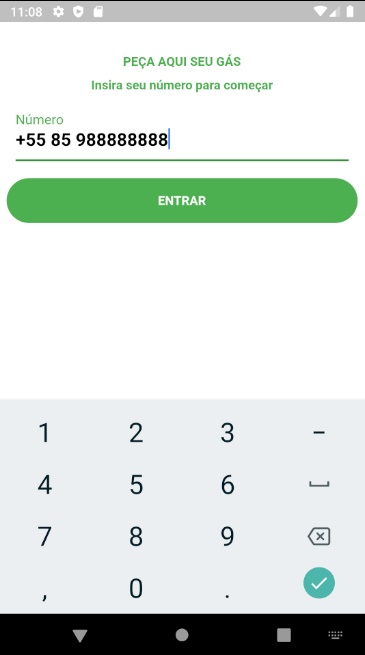
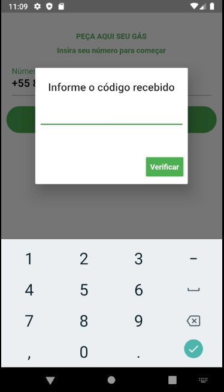
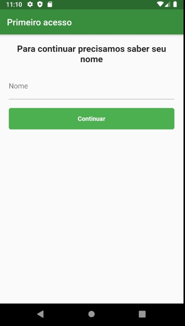
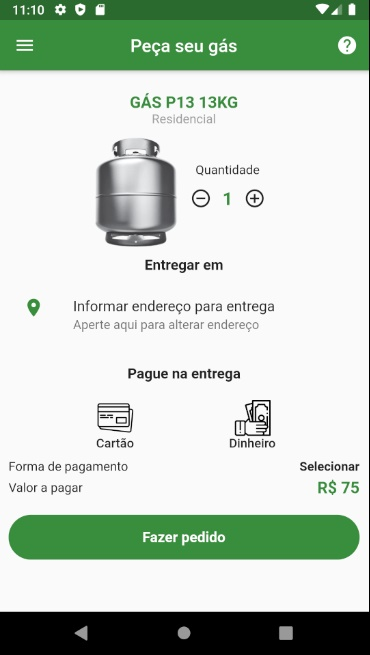
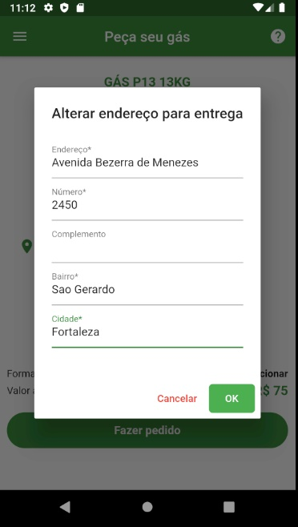
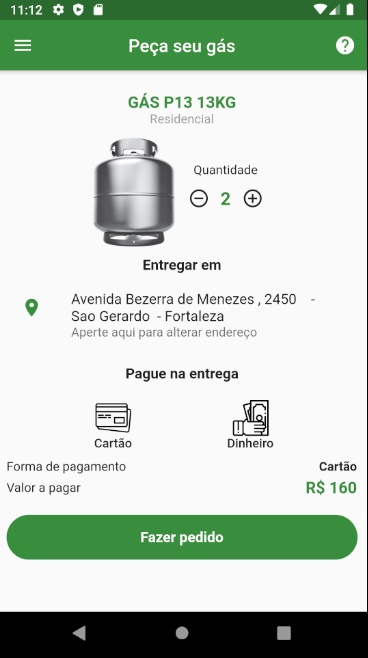
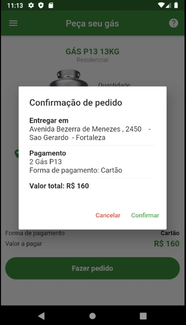
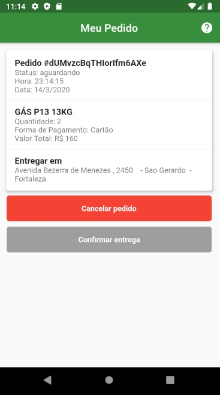
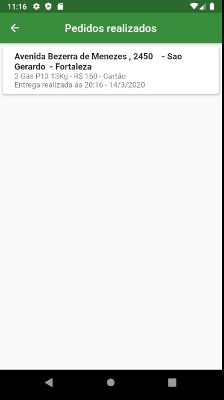

# PedeGas
Aplicativo para fazer pedidos de gás.

Linguagem utilizada: Dart/Flutter
Autenticação: Firebase
Banco de Dados: Firebase
Dependências utilizadas:
  cupertino_icons: ^0.1.2
  firebase_auth: ^0.14.0+5
  firebase_core: ^0.4.0+9
  flutter_masked_text: ^0.8.0
  cloud_firestore: ^0.12.9+4
  connection_status_bar: ^1.1.1
  firebase_messaging: ^5.1.6
  
=========================================================================================================

# 1. O cliente faz autenticação do seu número

# 2. Após a autenticação o cliente informa seu nome

# 3. Ao preencher seus dados o cliente será direcionado para a tela de pedidos

# 4. Apertando em "Informe endereço para entrega" o cliente informará o endereço

# 5. Com a quantidade de gás, endereço e forma de pagamento preenchidos o cliente poderá fazer o pedido

# 6. Quando o cliente apertar em "Fazer pedido" aparecerá um Alert Dialog para que o mesmo confira se está tudo certo

# 7. Após confirmado que está tudo certo o pedido será enviado para a distribuidora e a distribuidora irá encaminhar para o entregador. O cliente poderá ficar  acompanhando o status do seu pedido sendo atualizado em tempo real, podendo cancelar dentro de 5 minutos ou confirmar a entrega quando o entregador chegar.

# 8. Tela para que o cliente possa ver seus pedidos que foram realizados

